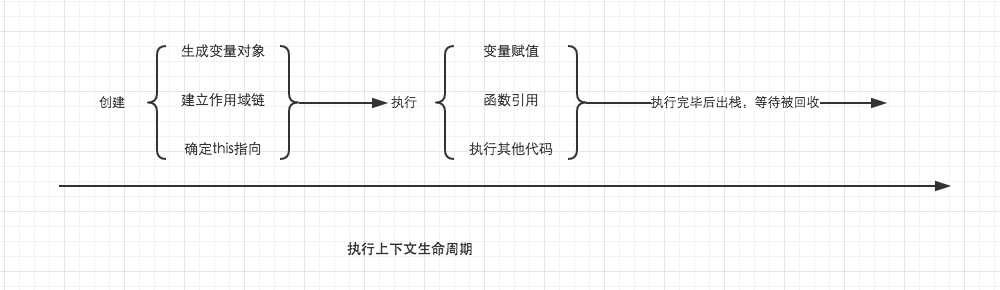
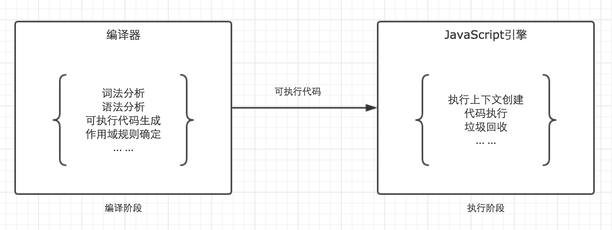
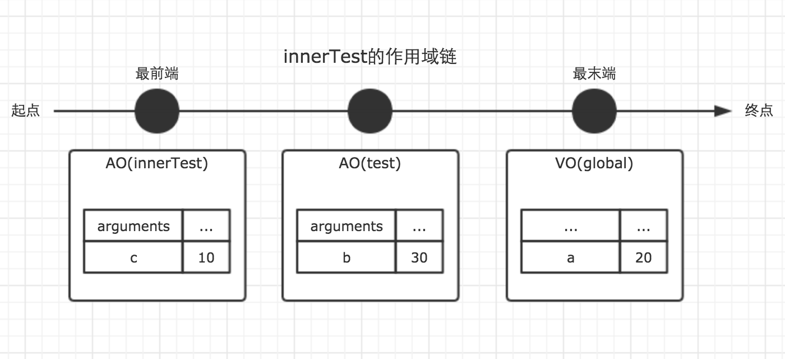
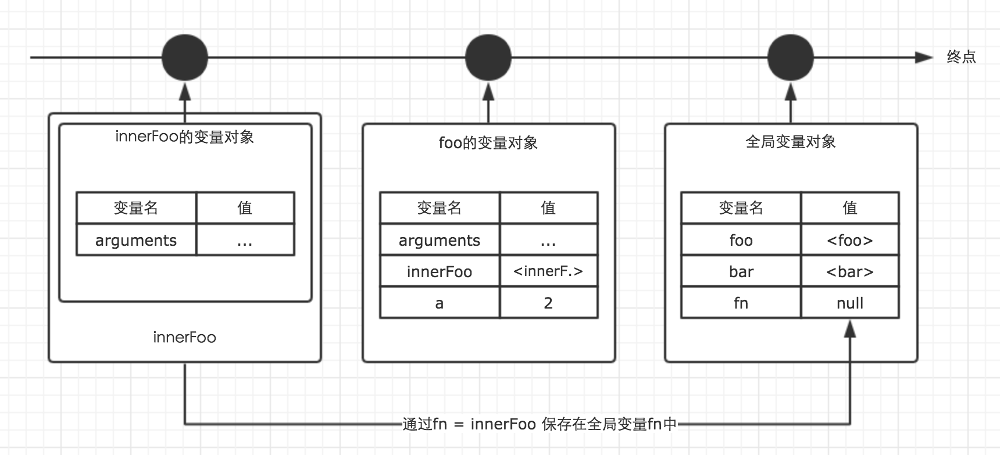

### 前端基础知识点
[TOC]
#### 一、内存空间
---
##### 数据类型

- 基本类型(栈 stack) : Number、String 、Boolean、Null 和 Undefined , Symbol(es6 新增)
  基本数据类型是按值访问,栈内存最大是8MB（超出报栈溢出）

- 引用类型(堆 heap) :Object 、Array 、Function 、Data
引用类型数据在栈内存中保存的实际上是对象在堆内存中的引用地址(指针)。

##### 认识三种数据架构
  1.堆（书架）

  2.栈：先进后出（LIFO，last in first out），是一种高效的列表，只对栈顶的数据进行添加和删除。
  > 对栈的操作主要是压栈push和出栈并删除pop，还有peek方法，找到栈顶数据，并返回这个数据。当然，栈还会有其他一些基本的操作如empty属性、clear方法、length等。

  3.队列：先进先出（FIFO，first in first out）,是只能在队首取出或者删除元素，在队尾插入元素的列表。
  > 对队列的操作主要是入队push和出队shift，还有front（读取队首数据）和back（读取队尾数据）。

#### 二、执行上下文(Execution Context)
---
执行上下文可以理解为当前代码的执行环境，它会形成一个作用域。JavaScript中的运行环境大概包括三种情况：
- 全局环境：JavaScript代码运行起来会首先进入该环境
- 函数环境：当函数被调用执行时，会进入当前函数中执行代码
- eval（不建议使用，可忽略）

在一个JavaScript程序中，会产生多个执行上下文，JavaScript引擎会以栈的方式来处理它们，这个栈，就是函数调用栈(call stack)。栈底永远都是全局上下文，而栈顶就是当前正在执行的上下文。
  ```javascript
  var color = 'blue';
  function changeColor() {
    var anotherColor = 'red';
    function swapColors() {
      var tempColor = anotherColor;
      anotherColor = color;
      color = tempColor;
    }
    swapColors();
  }
  changeColor();
  ```
  执行过程：
  
  
  
  > 注意：函数中，遇到return能直接终止可执行代码的执行，因此会直接将当前上下文弹出栈。

总结： 
  - 单线程
  - 同步执行，只有栈顶的上下文处于执行中，其他上下文需要等待
  - 全局上下文只有唯一的一个，它在浏览器关闭时出栈
  - 函数的执行上下文的个数没有限制
  - 每次某个函数被调用，就会有个新的执行上下文为其创建，即使是调用的自身函数，也是如此。

#### 三、变量对象(Variable Object) 
---
一个执行上下文的生命周期可以分为两个阶段:

- 创建阶段
在这个阶段中，执行上下文会分别**创建变量对象**，**建立作用域链**，以及**确定this的指向**。

- 代码执行阶段
创建完成之后，就会开始执行代码，这个时候，会完成**变量赋值**，**函数引用**，以及**执行其他代码**。



##### 创建变量对象
变量对象的创建，依次经历了以下几个过程。

1.   建立arguments对象。
检查当前上下文中的参数，建立该对象下的属性与属性值。

2.   检查当前上下文的函数声明，也就是使用function关键字声明的函数。
在变量对象中以函数名建立一个属性，属性值为指向该函数所在内存地址的引用。如果函数名的属性已经存在，那么该属性将会被新的引用所覆盖。

3.   检查当前上下文中的变量声明，每找到一个变量声明，就在变量对象中以变量名建立一个属性，属性值为undefined。
如果该变量名的属性已经存在，为了防止同名的函数被修改为undefined，则会直接跳过，原属性值不会被修改。
```javascript
function test() {
  console.log(a);
  console.log(foo());
  var a = 1;
  function foo() {
    return 2;
  }
}
test();

// 创建过程
testEC = {
  // 变量对象
  VO: {},
  scopeChain: {}
}
VO = {
  arguments: {...},  //注：在浏览器的展示中，函数的参数可能并不是放在arguments对象中，这里为了方便理解，做了这样的处理
  foo: <foo reference>  // 表示foo的地址引用
  a: undefined
}
```
未进入执行阶段之前，变量对象中的属性都不能访问。但是进入执行阶段之后，变量对象转变为了活动对象，里面的属性都能被访问了，然后开始进行执行阶段的操作。
> 变量对象和活动对象的区别：
>
> 他们其实都是同一个对象，只是处于执行上下文的不同生命周期。不过只有处于函数调用栈栈顶的执行上下文中的变量对象，才会变成活动对象。
```javascript
// 执行阶段
VO ->  AO   // Active Object
AO = {
  arguments: {...},
  foo: <foo reference>,
  a: 1,
  this: Window
}    
```
执行顺序：
```javascript
function test() {
  function foo() {
    return 2;
  }
  var a;
  console.log(a);
  console.log(foo());
  a = 1;
}
test();
```
##### 全局上下文的变量对象

全局上下文的变量对象，就是window对象，this也是指向window。

全局上下文的生命周期，与程序的生命周期一致，只要程序运行不结束，比如关掉浏览器窗口，全局上下文就会一直存在。

其他所有的上下文环境，都能直接访问全局上下文的属性。

```javascript
// 以浏览器中为例，全局对象为window
// 全局上下文
windowEC = {
  VO: Window,
  scopeChain: {},
  this: Window
}
```

#### 四、作用域链与闭包
---

##### 作用域

- JavaScript中只有全局作用域与函数作用域(因为eval我们平时开发中几乎不会用到它，这里不讨论)。

- 作用域与执行上下文：JavaScript代码的整个执行过程，分为两个阶段，代码编译阶段与代码执行阶段。编译阶段由编译器完成，将代码翻译成可执行代码，这个阶段作用域规则会确定。执行阶段由引擎完成，主要任务是执行可执行代码，执行上下文在这个阶段创建。


  

**作用域链，是由当前环境与上层环境的一系列变量对象组成，它保证了当前执行环境对符合访问权限的变量和函数的有序访问。**

```javascript
var a = 20;
function test() {
  var b = a + 10;
  function innerTest() {
    var c = 10;
    return b + c;
  }
  return innerTest();
}
test();
```

innerTest的执行上下文为：

```javascript
innerTestEC = {
  VO: {...},  // 变量对象
  scopeChain: [VO(innerTest), VO(test), VO(global)], // 作用域链
}
```




可知，作用域链是由一系列变量对象组成，我们可以在这个单向通道中，查询变量对象中的标识符，这样就可以访问到上一层作用域中的变量了。

##### 闭包

闭包由两部分组成，执行上下文（代号A）和在该执行上下文中创建的函数（代号B），当B执行时，如果访问了A中的变量对象，闭包就产生了。

>在大多数理解中，包括许多著名的书籍，文章里都以函数B的名字代指这里生成的闭包。而在chrome中，则以执行上下文A的函数名代指闭包。

```javascript
function foo() {
  var a = 1;
  function bar() {
    return a + 1;
  }
  return bar;
}
var bar = foo();
bar();
```

上面的例子，首先有执行上下文foo，在foo中定义了函数bar，而通过对外返回bar的方式让bar得以执行。当bar执行时，访问了foo内部的变量a，b，闭包产生。

JavaScript拥有自动的垃圾回收机制，当一个值在内存中失去引用时，垃圾回收机制会将其回收，释放内存。函数的执行上下文在执行完毕之后，执行上下文失去引用，那么该函数的生命周期就会结束，其占用的内存空间很快就会被垃圾回收器释放。可是闭包的存在，会阻止这一过程。

```javascript
var fn = null;
function foo() {
  var a = 2;
  function innnerFoo() {
    console.log(a);
  }
  fn = innnerFoo; // 将 innnerFoo的引用，赋值给全局变量中的fn
}
function bar() {
  fn(); // 此处的保留的innerFoo的引用
}
foo();
bar(); // 2
```
在上面的例子中，foo执行完毕之后，生命周期结束，按照垃圾回收机制会被回收。但是通过`fn = innnerFoo;`函数innnerFoo的引用被保存了下来，赋值给了全局变量fn。这个行为导致了foo的变量对象也被保留了下来。于是，函数fn在函数bar内部执行时，依然可以访问这个被保留下来的变量对象。所以此刻仍然能够访问到变量a的值。

这样，我们就可以称foo为闭包。



所以，通过闭包，我们可以在**其他的执行上下文中，访问到函数的内部变量**。比如在上面的例子中，我们在函数bar的执行环境中访问到了函数foo的a变量。

#### 五、this
---

this的指向，是在函数被调用的时候确定的，也就是执行上下文被创建的时候确定的。**在函数执行过程中，this一旦确定就不可更改。**

##### 函数中的this

几个例子：
```javascript
var a = 20;
function fn() {
  console.log(this.a);
}
fn();
```
```javascript
var a = 20;
function fn() {
  function foo() {
    console.log(this.a);
  }
  foo();
}
fn();
```
```javascript
var a = 20;
var obj = {
  a: 10,
  c: this.a + 20,
  fn: function () {
      return this.a;
  }
}
console.log(obj.c);
console.log(obj.fn());
```
函数被单独调用时，this指向undefined。非严格模式下，当this指向undefined时，会自动指向全局对象。
> **注意**：setTimeout 中的回调函数在严格模式下也指向 window 而不是 undefined。

方法调用：方法调用表现为对象属性访问的形式。

区分：

```javascript
['Hello', 'World'].join(', '); // 方法调用
({ ten: function() { return 10; } }).ten(); // 方法调用
var obj = {};  
obj.myFunction = function() {  
  return new Date().toString();
};
obj.myFunction(); // 方法调用

var otherFunction = obj.myFunction;  
otherFunction();     // 函数调用  
parseFloat('16.60'); // 函数调用  
isNaN(0);            // 函数调用  
```
方法调用时，this指向调用方法的对象本身。
> **注意**：方法会分离它自身的变量
>
> 一个对象中的方法有可能会被抽离成一个变量。当使用这个变量调用方法时，this已经不指向调用该方法的对象。即如果方法调用不依靠对象，那么就是一个函数调用。创建函数绑定可以修复上下文，使该方法被正确调用。
> ```javascript
> function Animal(type, legs) {  
>   this.type = type;
>   this.legs = legs;  
>   this.logInfo = function() {
>     console.log(this === myCat); // => false
>     console.log('The ' + this.type + ' has ' + this.legs + ' legs');
>   }
> }
> var myCat = new Animal('Cat', 4);  
> // 打印出 "The undefined has undefined legs"
> // 或者在严格模式下抛出错误 TypeError
> setTimeout(myCat.logInfo, 1000);  
> ```
> myCat.logInfo方法被分离了出来作为了参数传入函数内 setTimeout(myCat.logInfo)，然后 1s 后会发生函数调用。当 logInfo 被作为函数调用时，this 指向全局对象 window 或者在严格模式下为 undefined，因此对象信息没有正确地被打印。
>
> 方法绑定可以使用 .bind() 方法。如果被分离的方法绑定了 myCat 对象，那么上下文问题就可以被解决了：
> ```
> //打印 "The Cat has 4 legs"
> setTimeout(myCat.logInfo.bind(myCat), 1000); 
> ```
> 此时，上下文被修复，this指向bind函数的第一个参数即myCat。

##### 使用call，apply和bind改变this指向

this 本身是不可变的，但是 JavaScript 中提供了 call() / apply() / bind() 三个函数来在函数调用时设置 this 的值。
```javascript
// Sets obj1 as the value of this inside fun() and calls fun() passing elements of argsArray as its arguments.
fun.apply(obj1 [, argsArray])

// Sets obj1 as the value of this inside fun() and calls fun() passing arg1, arg2, arg3, ... as its arguments.
fun.call(obj1 [, arg1 [, arg2 [,arg3 [, ...]]]])

// Returns the reference to the function fun with this inside fun() bound to obj1 and parameters of fun bound to the parameters specified arg1, arg2, arg3, ....
fun.bind(obj1 [, arg1 [, arg2 [,arg3 [, ...]]]])
```

- apply和call都能够强制改变this的指向，它们的第一个参数都为this将要指向的对象，第二个参数，是要传给要执行的函数的参数。
- 其中call以一个一个的形式传递，apply以数组的形式传递。
- apply和call，他们都在调用的时候立即执行了函数，而bind返回一个新创建的函数，上下文环境为bind传递的第一个参数，等待调用。
- bind() 函数创建了一个永恒的上下文链并不可修改。一个绑定函数即使使用 call() 或者 apply()传入其他不同的上下文环境，也不会更改它之前连接的上下文环境。
##### 构造函数上的this
如果函数作为构造函数用，那么其中的this就代表它即将new出来的对象。这是new语法带来的。
new做了：

- 创建一个新对象
- 将构造函数的this指向这个新对象
- 指向构造函数的代码，为这个对象添加属性，方法等；
- return新对象

因此，当new操作符调用构造函数时，this其实指向的是这个新创建的对象，最后又将新的对象返回出来，被实例对象接收。因此构造函数的this，指向了新的实例对象。
> **注意**：丢失new关键词
>
  ```javascript
  function Vehicle(type, wheelsCount) {  
    this.type = type;
    this.wheelsCount = wheelsCount;
    return this;
  }
  // 函数调用
  var car = Vehicle('Car', 4);  
  car.type;              // => 'Car'  
  car.wheelsCount // => 4  
  car === window  // => true 
  ```
> 丢失了new则不会创建新的对象，它设置的属相其实是挂在Window对象上的。  

##### 箭头函数中的this

- 箭头函数并不创建它自身执行的上下文，因此this取决于它定义时的外部函数。
  ```javascript
  class Point {  
    constructor(x, y) {
      this.x = x;
      this.y = y;
    }
    log() {
      console.log(this === myPoint); // => true
      setTimeout(()=> {
        console.log(this === myPoint);      // => true
        console.log(this.x + ':' + this.y); // => '95:165'
      }, 1000);
    }
  }
  var myPoint = new Point(95, 165);  
  myPoint.log(); 
  ```
  箭头函数没有自己的this，它会捕获其所在上下文的 this 值，作为自己的 this 值。例中箭头函数捕获了它在定义时的函数上下文，即myPoint对象，作为自己的this值。
  > 如果尝试在上述例子中使用正常函数，那么它会创建自身的作用域（window 或者严格模式下 undefined）。
  >
  > 因此，要使同样的代码可以正确运行就必须人工绑定上下文，即 setTimeout(function() {...}.bind(this))。
  >
  >使用箭头函数就可以省略函数绑定,直接继承上下文。

- 箭头函数拥有静态的上下文，即一次绑定之后，便不可再修改（不会因为调用而改变）。

- 箭头函数不可以用作构造器，否则会抛出错误。

- 使用箭头函数定义方法
  ```javascript
  function Period (hours, minutes) {  
    this.hours = hours;
    this.minutes = minutes;
  }
  Period.prototype.format = () => {  
    console.log(this === window); // => true
    return this.hours + ' hours and ' + this.minutes + ' minutes';
  };
  var walkPeriod = new Period(2, 30);  
  walkPeriod.format(); // => 'undefined hours and undefined minutes' 
  ```
  format是一个定义在全局环境下的箭头函数，他的上下文是全局对象，因为this指向window。即使它挂载在对象walkPeriod上，它依然不会改变自己的静态上下文环境。

  正确的函数表达式可以解决这个问题，因为普通函数可以改变调用时的上下文环境。
  ```js
   function Period (hours, minutes) {  
    this.hours = hours;
    this.minutes = minutes;
  }
  Period.prototype.format = function() {  
    console.log(this === walkPeriod); // => true
    return this.hours + ' hours and ' + this.minutes + ' minutes';
  };
  var walkPeriod = new Period(2, 30);  
  walkPeriod.format(); // => '2 hours and 30 minutes'  
  ```
  walkPeriod.format() 是一个在对象中的方法调用，它的上下文环境为walkPeriod,this指向walkPeriod。

#### 六、Reference
---

这波能反杀:[前端基础进阶系列](https://www.jianshu.com/p/cd3fee40ef59)

getify：[你不懂JS（系列丛书）](https://github.com/getify/You-Dont-Know-JS/tree/1ed-zh-CN)

zchen9：[JavaScript this?](https://github.com/zchen9/code/issues/1)    [--原文：Gentle explanation of 'this' keyword in JavaScript](https://dmitripavlutin.com/gentle-explanation-of-this-in-javascript/)

halfrost:[揭开 this & that 之迷](https://github.com/halfrost/Halfrost-Field/blob/master/contents/JavaScript/%E6%8F%AD%E5%BC%80%20this%20%26%20that%20%E4%B9%8B%E8%BF%B7.md)
